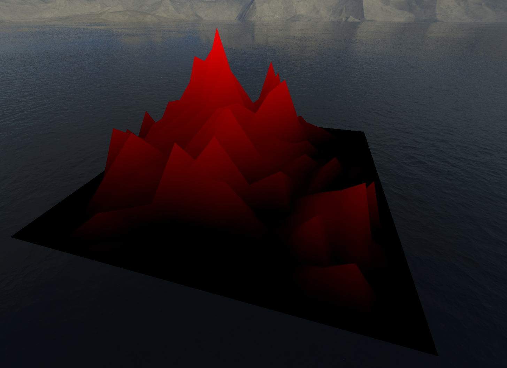
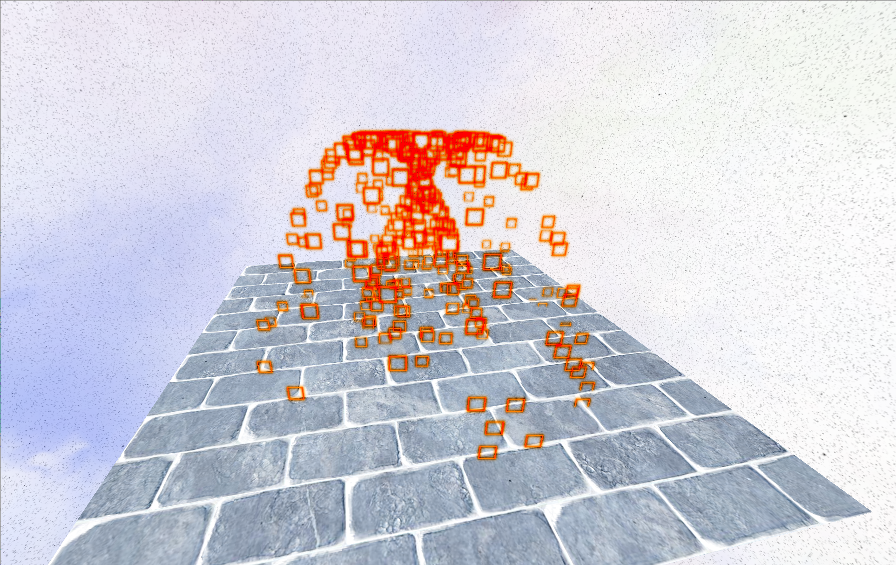
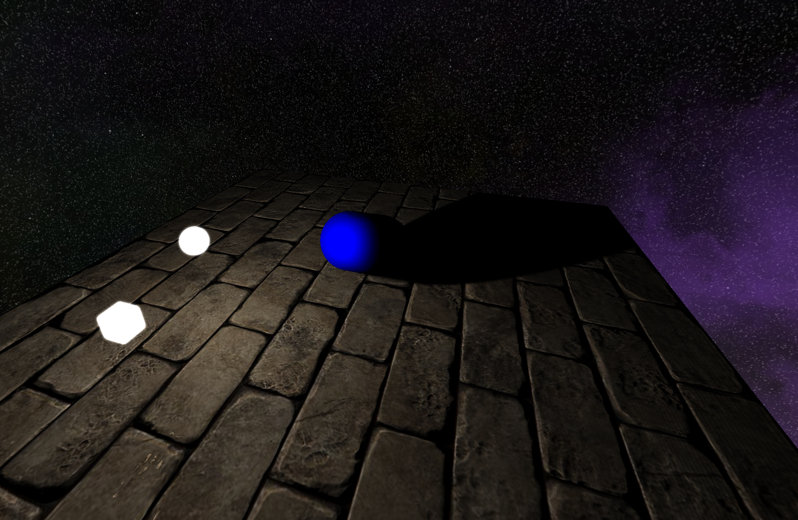
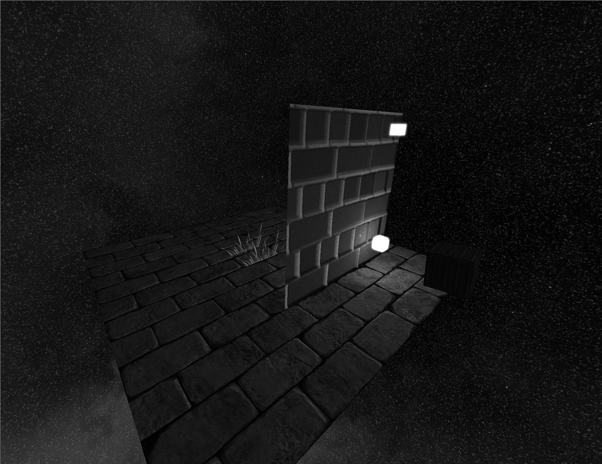

# Tri 3D Engine
A simple 3D engine built using OpenGL. See [examples](examples) for example usage.

## Description
Core features: 
1. creating meshes/models
2. loading meshes from wavefront .obj files
3. multiple ambient/point/directional lights using PHONG + bloom
4. skyboxes
5. materials
6. camera
7. dynamic shader library (to avoid ubershader approach)
8. viewport postprocessing (filters, grayscale etc.)
9. omnidirectional and cascaded shadow mapping
10. heightmaps using tesselation

For now the engine comes as static libraries (tricore, triutils, triextra). 

## Building

```
cmake -DCMAKE_BUILD_TYPE=Debug -B./build -G Ninja
cmake --build build/ --config Debug --target <target>
```

## Screenshots

### Heightmap with tesselation


### Example particles generator


### Shadows


### Scene creation and grayscale postprocessing



